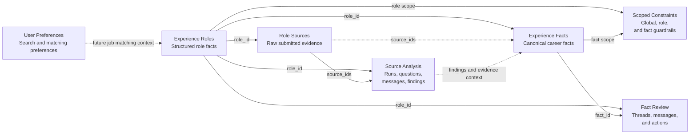
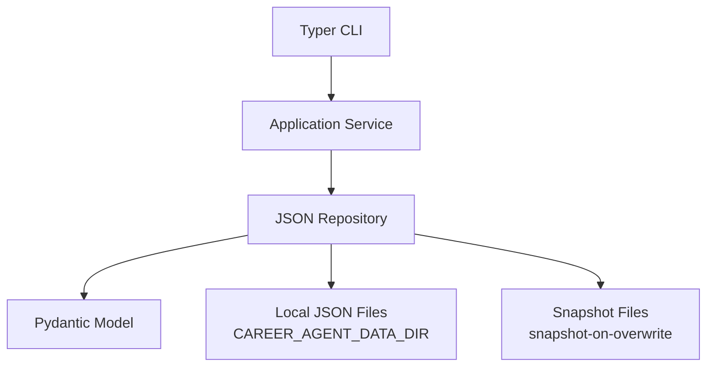
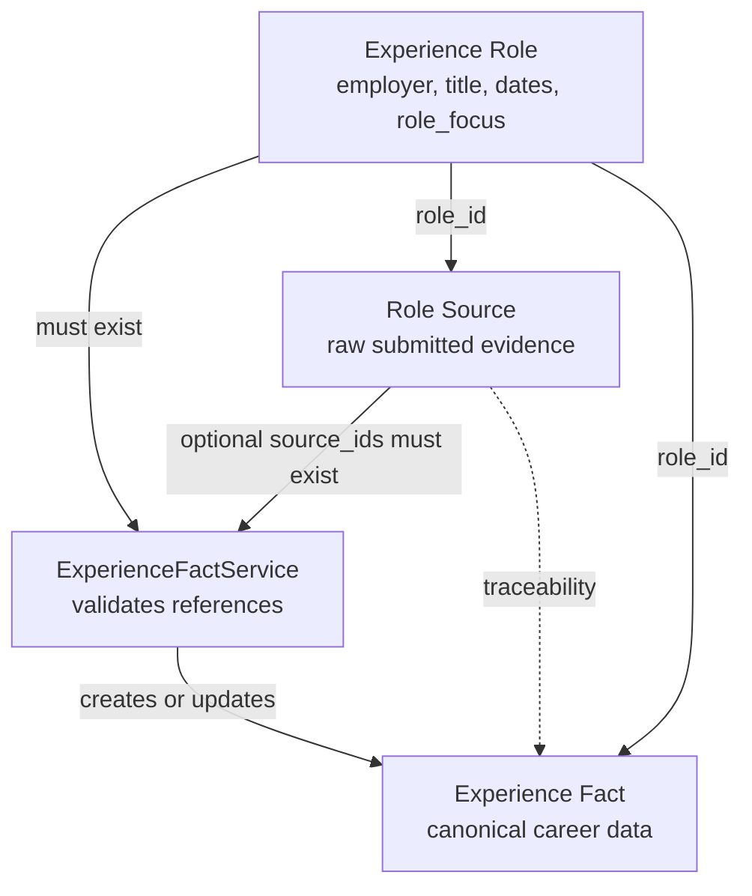
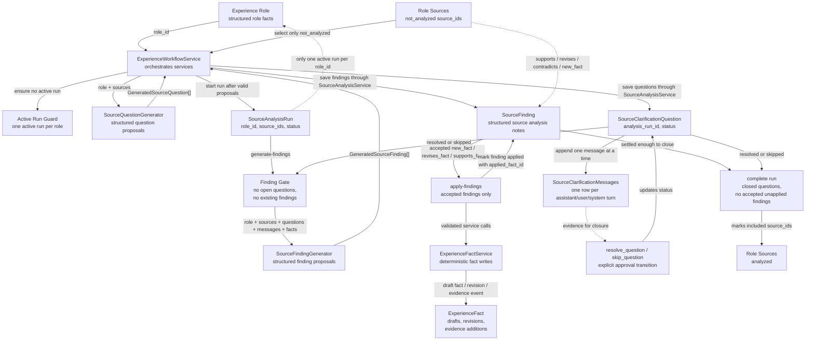
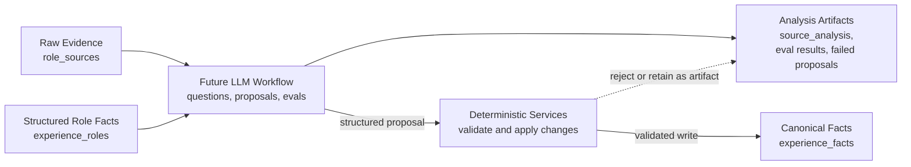
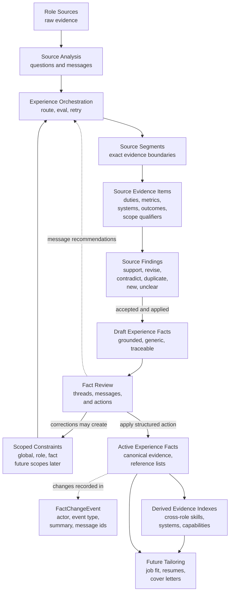
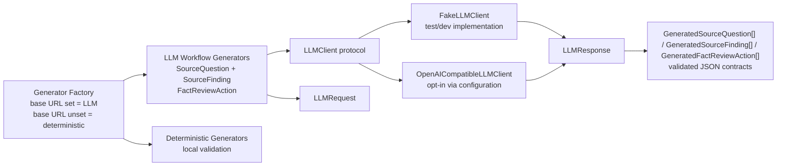
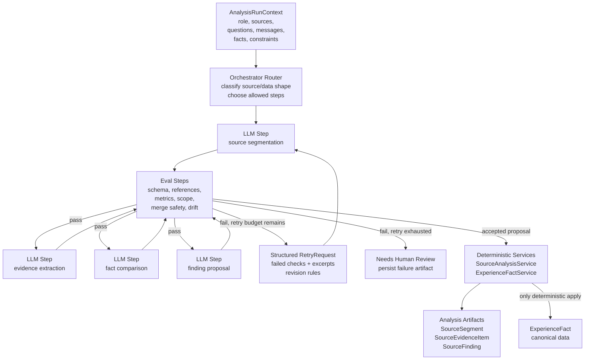

# Architecture Diagrams

This page contains Mermaid diagrams for the current `v2-foundation` architecture.

The diagrams are intentionally focused on implemented boundaries and near-term design direction. They should help explain the project without implying that the future LLM workflow is fully implemented.

For a database-style view of the JSON records and relationships, see
[Database-Style ER Diagram](er-diagram.md).

## Component Boundaries

## Layered Flow

Every current component follows the same foundation pattern.

The CLI parses input and renders output. Services own workflow rules. Repositories own local persistence. Pydantic models own validation and JSON serialization.

## Role Source To Fact Flow

This diagram shows the current deterministic flow from role facts and source material into canonical facts.

## Source Analysis Workflow

Source Analysis stores workflow evidence for clarifying submitted role source material. It does not directly create canonical facts.

The important guardrail is that adding messages does not close a question. A future LLM workflow may decide it is ready to close a question, but it must call an explicit transition that can later include eval approval.

The workflow generates and validates clarification question proposals before it creates the analysis run. This prevents malformed LLM output from creating an active run that blocks later attempts.

Source findings are structured analysis notes. Accepting a finding records that
the analysis artifact was accepted; canonical fact changes happen only when the
workflow applies accepted findings through `ExperienceFactService`.

Finding generation is blocked while any clarification question for the run is
open, and it is also blocked if findings already exist for the run. The
deterministic finder is only a local validation harness; the LLM-backed finder
performs the real source extraction and classification.

Applying findings is repeat-safe because applied findings move to `applied`
status and record `applied_fact_id`. Unsupported accepted finding types stay as
analysis artifacts and are not automatically canonicalized.

A source analysis run is completed separately after questions are closed and
accepted findings have been applied; completion marks the included role sources
`analyzed`. Archiving an active run closes the run without marking sources
analyzed.

## Canonical Data Vs Analysis Artifacts

The future LLM workflow should not freely mutate canonical career data. It should create structured proposals and use deterministic services to apply approved changes.

This is the core guardrail model: AI can reason and propose, but application services enforce boundaries before canonical data changes.

## Experience Evidence Normalization Direction

The next workflow stage should normalize source analysis evidence into grounded
experience facts before any persuasive resume or cover-letter writing happens.

Experience facts are still data normalization. They should use plain,
professional, reusable terminology and must stay grounded in cited source,
question, and message evidence. If evidence is missing, the workflow should ask
for clarification or record missing evidence rather than inventing scope,
metrics, or responsibilities.

Fact merging should be conservative. Similar wording, similar metrics, or shared
tools do not prove that two facts describe the same work. Unclear merges should
remain separate until the user or evidence confirms they belong together.

Future LLM behavior should be orchestrated as narrow checklist steps, such as
source routing, segmentation, evidence extraction, fact comparison, finding
proposal, response classification, constraint extraction, draft fact generation,
drift checking, merge checking, and clarification planning. Application
services still own persistence and explicit state transitions.

History has separate responsibilities: messages capture conversational rationale,
change events capture semantic fact mutations and lifecycle transitions, and
snapshots remain file-level recovery artifacts.

Fact Review messages are workflow evidence. Message recommendations do not
mutate facts by themselves. The action generator can turn review context into
proposed structured actions after loading the target fact, role, messages,
existing actions, and applicable active constraints. Structured review actions
can be applied, but they still call deterministic services for revision,
rejection, activation, evidence updates, and proposed scoped constraint
creation.

No-action generation is valid. It leaves the review thread open and leaves the
fact unchanged, which allows paused or exploratory review conversations to be
resumed later. LLM-generated activation proposals should eventually pass through
an approval/eval flow before application. The current workflow approval boundary
has a dummy implementation that approves for local validation. If a future
approval flow rejects activation, the review action is rejected and the fact
remains unchanged.

## LLM Boundary And Orchestration

The LLM boundary owns provider-neutral completion calls. Experience
Orchestration owns routing, eval/retry behavior, and deterministic service
transitions.

The current LLM boundary has a provider-neutral client protocol plus an opt-in
OpenAI-compatible transport. Model-backed generators depend on this boundary
instead of embedding provider calls directly in workflow services.

The planned orchestration layer decomposes source-to-fact analysis into narrow
steps that can work with local or smaller models.

The orchestration rule is: LLM components analyze and propose, eval components
critique and validate, orchestrators route and retry, and domain services
persist and enforce deterministic rules.

## Current Storage Shape

```mermaid
flowchart TD
    DataDir["CAREER_AGENT_DATA_DIR"]

    DataDir --> Preferences["user_preferences/user_preferences.json"]
    DataDir --> Roles["experience_roles/experience_roles.json"]
    DataDir --> Sources["role_sources/role_sources.json"]
    DataDir --> Facts["experience_facts/experience_facts.json"]
    DataDir --> FactEvents["experience_facts/fact_change_events.json"]
    DataDir --> Constraints["scoped_constraints/scoped_constraints.json"]
    DataDir --> Review["fact_review/*.json"]
    DataDir --> Analysis["source_analysis/*.json"]
    DataDir --> Snapshots["snapshots/"]

    Snapshots --> PreferenceSnapshots["user_preferences/<timestamp>-user_preferences.json"]
    Snapshots --> RoleSnapshots["experience_roles/<timestamp>-experience_roles.json"]
    Snapshots --> SourceSnapshots["role_sources/<timestamp>-role_sources.json"]
    Snapshots --> FactSnapshots["experience_facts/<timestamp>-experience_facts.json"]
    Snapshots --> FactEventSnapshots["experience_facts/<timestamp>-fact_change_events.json"]
    Snapshots --> ConstraintSnapshots["scoped_constraints/<timestamp>-scoped_constraints.json"]
    Snapshots --> ReviewSnapshots["fact_review/<timestamp>-*.json"]
    Snapshots --> AnalysisSnapshots["source_analysis/<timestamp>-*.json"]
```

