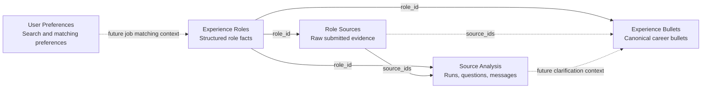
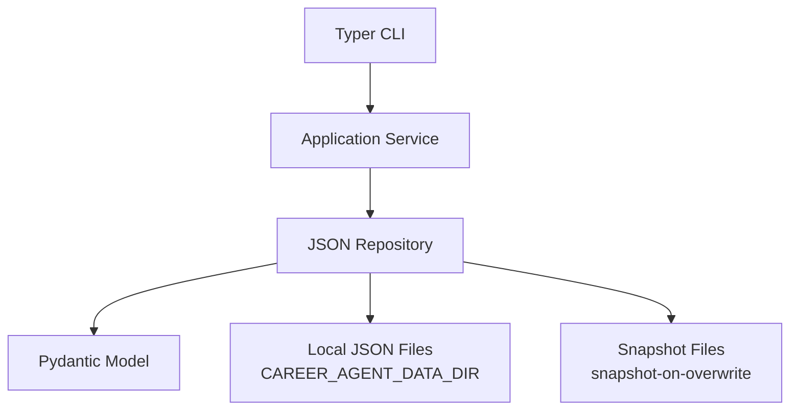
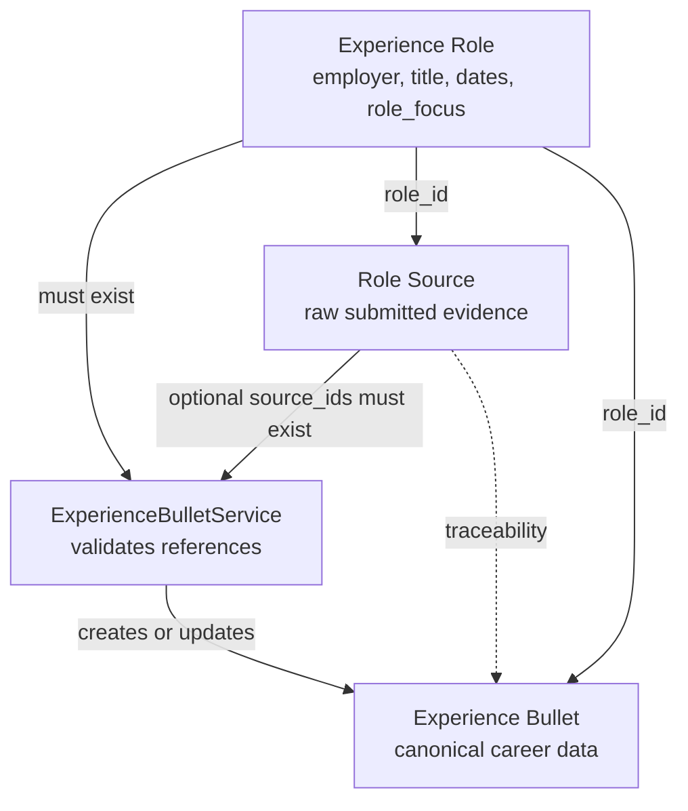
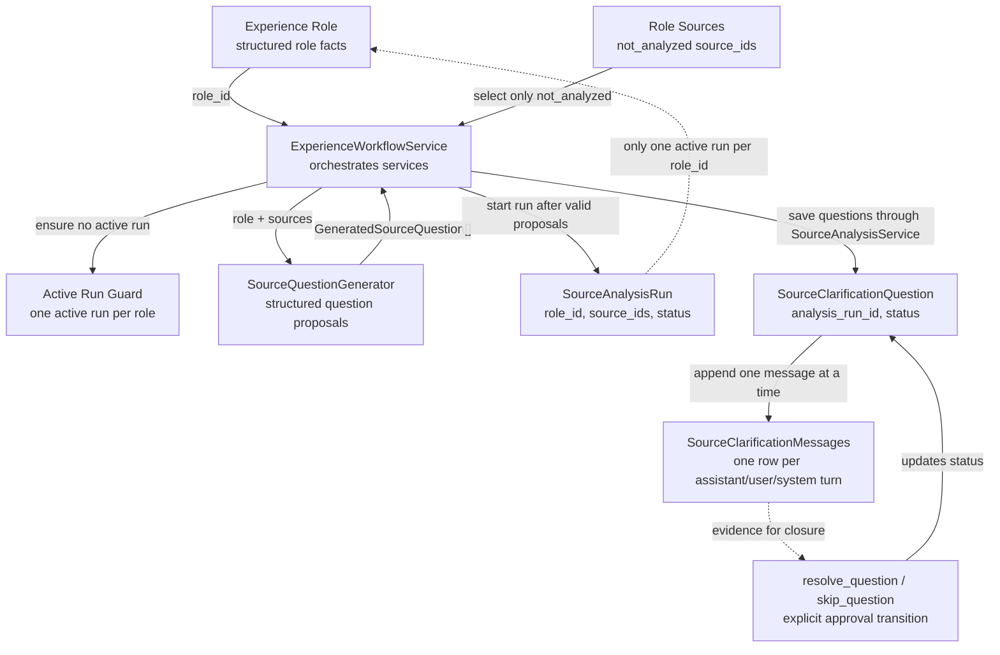
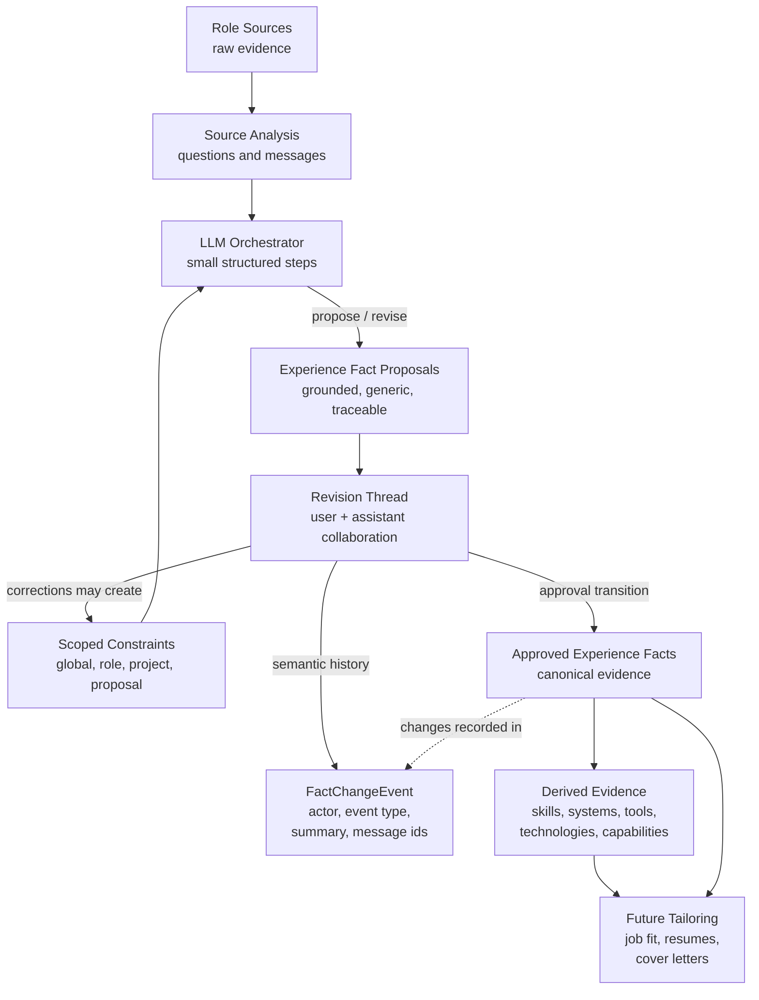
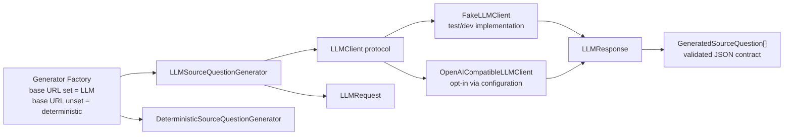
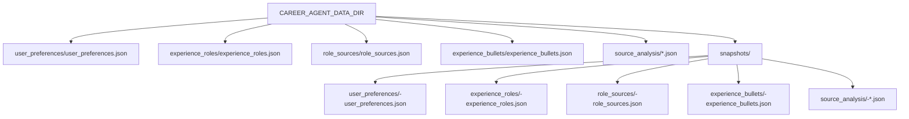

# Architecture Diagrams

This page contains Mermaid diagrams for the current `v2-foundation` architecture.

The diagrams are intentionally focused on implemented boundaries and near-term design direction. They should help explain the project without implying that the future LLM workflow is fully implemented.

## Component Boundaries

## Layered Flow

Every current component follows the same foundation pattern.

The CLI parses input and renders output. Services own workflow rules. Repositories own local persistence. Pydantic models own validation and JSON serialization.

## Role Source To Bullet Flow

This diagram shows the current deterministic flow from role facts and source material into canonical bullets.

## Source Analysis Workflow

Source Analysis stores workflow evidence for clarifying submitted role source material. It does not directly create canonical bullets.

The important guardrail is that adding messages does not close a question. A future LLM workflow may decide it is ready to close a question, but it must call an explicit transition that can later include eval approval.

The workflow generates and validates clarification question proposals before it creates the analysis run. This prevents malformed LLM output from creating an active run that blocks later attempts.

## Canonical Data Vs Analysis Artifacts

The future LLM workflow should not freely mutate canonical career data. It should create structured proposals and use deterministic services to apply approved changes.

This is the core guardrail model: AI can reason and propose, but application services enforce boundaries before canonical data changes.

## Experience Evidence Normalization Direction

The next workflow stage should normalize source analysis evidence into grounded
experience facts before any persuasive resume or cover-letter writing happens.

Experience facts are still data normalization. They should use plain,
professional, reusable terminology and must stay grounded in cited source,
question, and message evidence. If evidence is missing, the workflow should ask
for clarification or record missing evidence rather than inventing scope,
metrics, or responsibilities.

Fact merging should be conservative. Similar wording, similar metrics, or shared
tools do not prove that two facts describe the same work. Unclear merges should
remain separate until the user or evidence confirms they belong together.

Future LLM behavior should be orchestrated as narrow checklist steps, such as
response classification, constraint extraction, fact proposal, drift checking,
merge checking, and clarification planning. Application services still own
persistence and explicit state transitions.

History has separate responsibilities: messages capture conversational rationale,
change events capture semantic fact/proposal mutations, and snapshots remain
file-level recovery artifacts.

## LLM Boundary

The current LLM boundary has a provider-neutral client protocol plus an opt-in
OpenAI-compatible transport. Model-backed generators depend on this boundary
instead of embedding provider calls directly in workflow services.

## Current Storage Shape

