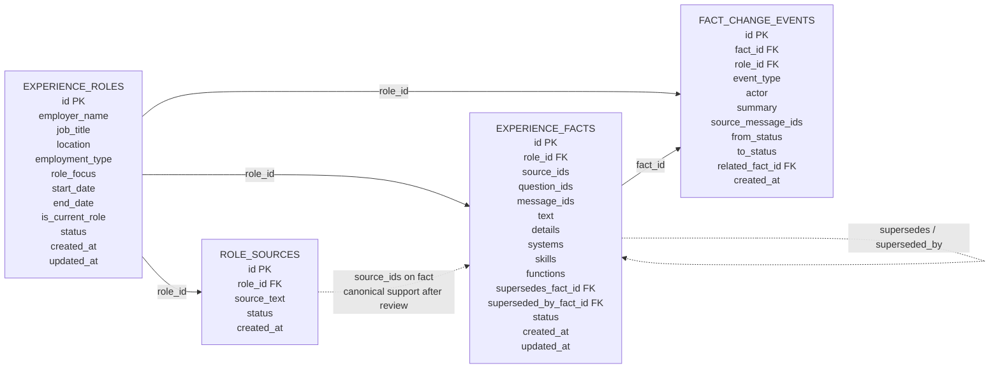
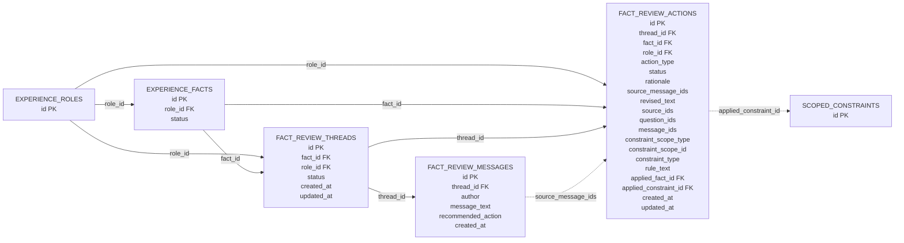
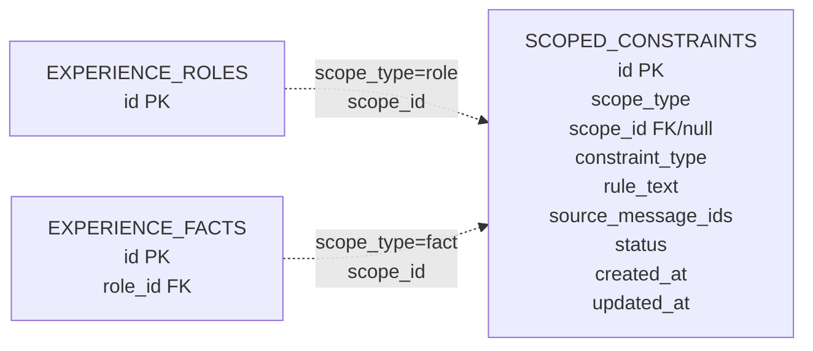
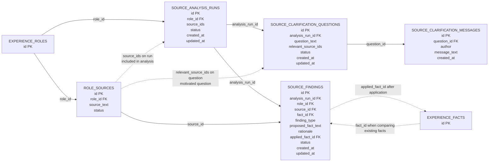
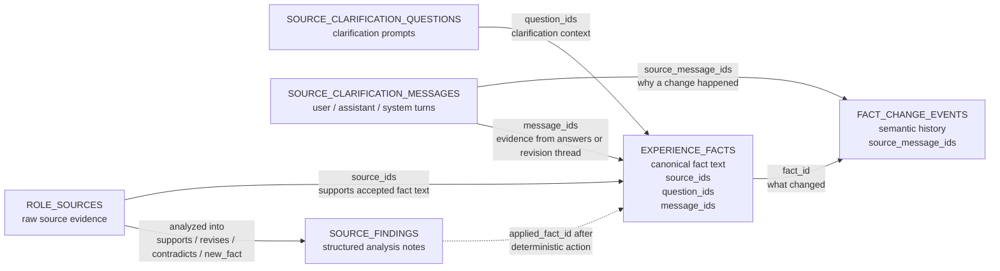

# Database-Style Relationship Diagrams

Career Agent uses local JSON files, but the records are intentionally shaped like
database tables. This page shows the current persisted data model using smaller
relationship diagrams instead of one dense ERD.

The diagrams describe the current implementation, not the full future workflow.
Several relationships are stored as list fields in JSON records rather than as
separate join tables.

## Core Career Data



## Fact Review Data



## Scoped Constraint Data



## Source Analysis Data



## Evidence Into Experience Facts



## Core Tables

### `experience_roles.json`

| Column | Type | Notes |
| --- | --- | --- |
| `id` | string | Primary key. |
| `employer_name` | string | Required. |
| `job_title` | string | Required. |
| `location` | string/null | Optional. |
| `employment_type` | enum/null | Optional. |
| `role_focus` | string/null | User-authored context, not polished resume language. |
| `start_date` | object | `{year, month}`. |
| `end_date` | object/null | Required unless current role. |
| `is_current_role` | boolean | Controls date validation. |
| `status` | enum | `input_required`, `review_required`, `reviewed`, `archived`. |
| `created_at` | datetime | UTC timestamp. |
| `updated_at` | datetime | UTC timestamp. |

### `role_sources.json`

| Column | Type | Relationship | Notes |
| --- | --- | --- | --- |
| `id` | string | Primary key. | Stable source id. |
| `role_id` | string | `ExperienceRole.id` | Source belongs to one role. |
| `source_text` | string | | Preserved exactly as submitted. |
| `status` | enum | | `not_analyzed`, `analyzed`, `archived`. |
| `created_at` | datetime | | UTC timestamp. |

### `experience_facts.json`

| Column | Type | Relationship | Notes |
| --- | --- | --- | --- |
| `id` | string | Primary key. | Stable fact id. |
| `role_id` | string | `ExperienceRole.id` | Fact belongs to one role. |
| `source_ids` | list[string] | `RoleSourceEntry.id` | Sources that support the fact text. |
| `question_ids` | list[string] | `SourceClarificationQuestion.id` | Questions used as evidence/context. |
| `message_ids` | list[string] | `SourceClarificationMessage.id` | Messages used as evidence/context. |
| `text` | string | | Canonical normalized experience fact. |
| `details` | list[string] | | Optional second-level details. |
| `systems` | list[string] | | Grounded systems/platform references. |
| `skills` | list[string] | | Grounded skill/tool/method references. |
| `functions` | list[string] | | Grounded duty/function references. |
| `supersedes_fact_id` | string/null | `ExperienceFact.id` | Prior fact replaced by this fact. |
| `superseded_by_fact_id` | string/null | `ExperienceFact.id` | Later fact that replaced this fact. |
| `status` | enum | | `draft`, `needs_clarification`, `active`, `rejected`, `superseded`, `archived`. |
| `created_at` | datetime | | UTC timestamp. |
| `updated_at` | datetime | | UTC timestamp. |

### `fact_change_events.json`

| Column | Type | Relationship | Notes |
| --- | --- | --- | --- |
| `id` | string | Primary key. | Stable event id. |
| `fact_id` | string | `ExperienceFact.id` | Fact this event records. |
| `role_id` | string | `ExperienceRole.id` | Role scope for filtering. |
| `event_type` | enum | | Created, revised, activated, rejected, etc. |
| `actor` | enum | | `user`, `llm`, or `system`. |
| `summary` | string/null | | Human-readable reason or note. |
| `source_message_ids` | list[string] | `SourceClarificationMessage.id` or `FactReviewMessage.id` | Workflow messages that explain/support the change. |
| `from_status` | enum/null | | Prior fact status, when applicable. |
| `to_status` | enum/null | | New fact status, when applicable. |
| `related_fact_id` | string/null | `ExperienceFact.id` | Related fact, often revision-related. |
| `created_at` | datetime | | UTC timestamp. |

## Fact Review Tables

### `fact_review_threads.json`

| Column | Type | Relationship | Notes |
| --- | --- | --- | --- |
| `id` | string | Primary key. | Stable review thread id. |
| `fact_id` | string | `ExperienceFact.id` | Fact being reviewed. |
| `role_id` | string | `ExperienceRole.id` | Role scope for filtering. |
| `status` | enum | | `open`, `resolved`, `archived`. |
| `created_at` | datetime | | UTC timestamp. |
| `updated_at` | datetime | | UTC timestamp. |

### `fact_review_messages.json`

| Column | Type | Relationship | Notes |
| --- | --- | --- | --- |
| `id` | string | Primary key. | Stable review message id. |
| `thread_id` | string | `FactReviewThread.id` | Message belongs to one review thread. |
| `author` | enum | | `assistant`, `user`, or `system`. |
| `message_text` | string | | Review message text. |
| `recommended_action` | enum | | `revise_fact`, `add_evidence`, `split_fact`, `reject_fact`, `activate_fact`, `propose_constraint`, or `none`. |
| `created_at` | datetime | | UTC timestamp. |

### `fact_review_actions.json`

| Column | Type | Relationship | Notes |
| --- | --- | --- | --- |
| `id` | string | Primary key. | Stable review action id. |
| `thread_id` | string | `FactReviewThread.id` | Action belongs to one review thread. |
| `fact_id` | string | `ExperienceFact.id` | Fact targeted by the action. |
| `role_id` | string | `ExperienceRole.id` | Role scope for filtering. |
| `action_type` | enum | | `activate_fact`, `reject_fact`, `revise_fact`, `add_evidence`, or `propose_constraint`. |
| `status` | enum | | `proposed`, `applied`, `rejected`, or `archived`. |
| `rationale` | string/null | | Human-readable reason for the proposal. |
| `source_message_ids` | list[string] | `FactReviewMessage.id` | Review messages that explain/support the action. |
| `revised_text` | string/null | | Required for `revise_fact` actions. |
| `source_ids` | list[string] | `RoleSourceEntry.id` | Sources to add or preserve when applying. |
| `question_ids` | list[string] | `SourceClarificationQuestion.id` | Questions to add as evidence when applying. |
| `message_ids` | list[string] | `SourceClarificationMessage.id` | Clarification messages to add as evidence when applying. |
| `constraint_scope_type` | enum/null | | Required for `propose_constraint` actions. |
| `constraint_scope_id` | string/null | `ExperienceRole.id` or `ExperienceFact.id` | Required for role/fact constraint proposals. |
| `constraint_type` | enum/null | | `hard_rule` or `preference`; required for `propose_constraint`. |
| `rule_text` | string/null | | Rule text required for `propose_constraint`. |
| `applied_fact_id` | string/null | `ExperienceFact.id` | Fact returned by deterministic action application. |
| `applied_constraint_id` | string/null | `ScopedConstraint.id` | Proposed constraint created by action application. |
| `created_at` | datetime | | UTC timestamp. |
| `updated_at` | datetime | | UTC timestamp. |

## Scoped Constraint Tables

### `scoped_constraints.json`

| Column | Type | Relationship | Notes |
| --- | --- | --- | --- |
| `id` | string | Primary key. | Stable constraint id. |
| `scope_type` | enum | | `global`, `role`, or `fact`. |
| `scope_id` | string/null | `ExperienceRole.id` or `ExperienceFact.id` | Must be null for `global`; required for `role` and `fact`. |
| `constraint_type` | enum | | `hard_rule` or `preference`. |
| `rule_text` | string | | Plain-language rule or preference text. |
| `source_message_ids` | list[string] | Workflow message ids. | Messages that explain/support the constraint. |
| `status` | enum | | `proposed`, `active`, `rejected`, or `archived`. |
| `created_at` | datetime | | UTC timestamp. |
| `updated_at` | datetime | | UTC timestamp. |

## Source Analysis Tables

### `analysis_runs.json`

| Column | Type | Relationship | Notes |
| --- | --- | --- | --- |
| `id` | string | Primary key. | Stable analysis run id. |
| `role_id` | string | `ExperienceRole.id` | Run is scoped to one role. |
| `source_ids` | list[string] | `RoleSourceEntry.id` | Sources included in the run. |
| `status` | enum | | `active`, `completed`, `archived`. |
| `created_at` | datetime | | UTC timestamp. |
| `updated_at` | datetime | | UTC timestamp. |

### `clarification_questions.json`

| Column | Type | Relationship | Notes |
| --- | --- | --- | --- |
| `id` | string | Primary key. | Stable question id. |
| `analysis_run_id` | string | `SourceAnalysisRun.id` | Question belongs to one run. |
| `question_text` | string | | Clarification question. |
| `relevant_source_ids` | list[string] | `RoleSourceEntry.id` | Sources that motivated the question. |
| `status` | enum | | `open`, `resolved`, `skipped`. |
| `created_at` | datetime | | UTC timestamp. |
| `updated_at` | datetime | | UTC timestamp. |

### `clarification_messages.json`

| Column | Type | Relationship | Notes |
| --- | --- | --- | --- |
| `id` | string | Primary key. | Stable message id. |
| `question_id` | string | `SourceClarificationQuestion.id` | Message belongs to one question thread. |
| `author` | enum | | `assistant`, `user`, or `system`. |
| `message_text` | string | | Message text. |
| `created_at` | datetime | | UTC timestamp. |

### `source_findings.json`

| Column | Type | Relationship | Notes |
| --- | --- | --- | --- |
| `id` | string | Primary key. | Stable finding id. |
| `analysis_run_id` | string | `SourceAnalysisRun.id` | Finding belongs to one analysis run. |
| `role_id` | string | `ExperienceRole.id` | Finding is scoped to one role. |
| `source_id` | string | `RoleSourceEntry.id` | Source evaluated by this finding. |
| `fact_id` | string/null | `ExperienceFact.id` | Existing fact being compared, when applicable. |
| `finding_type` | enum | | `supports_fact`, `revises_fact`, `contradicts_fact`, `duplicates_fact`, `new_fact`, `unclear`, `unrelated`. |
| `proposed_fact_text` | string/null | | Candidate normalized fact text for `new_fact` findings. |
| `rationale` | string/null | | Explanation for the finding. |
| `applied_fact_id` | string/null | `ExperienceFact.id` | Fact created or updated when the finding is applied. |
| `status` | enum | | `proposed`, `accepted`, `applied`, `rejected`, `archived`. |
| `created_at` | datetime | | UTC timestamp. |
| `updated_at` | datetime | | UTC timestamp. |

## Relationship Matrix

| From | Field | To | Meaning |
| --- | --- | --- | --- |
| `RoleSourceEntry` | `role_id` | `ExperienceRole.id` | Source belongs to a role. |
| `ExperienceFact` | `role_id` | `ExperienceRole.id` | Fact belongs to a role. |
| `FactReviewThread` | `fact_id` | `ExperienceFact.id` | Review thread belongs to a fact. |
| `FactReviewThread` | `role_id` | `ExperienceRole.id` | Review thread is scoped to a role. |
| `FactReviewMessage` | `thread_id` | `FactReviewThread.id` | Message belongs to a review thread. |
| `FactReviewAction` | `thread_id` | `FactReviewThread.id` | Action belongs to a review thread. |
| `FactReviewAction` | `fact_id` | `ExperienceFact.id` | Action targets an experience fact. |
| `FactReviewAction` | `role_id` | `ExperienceRole.id` | Action is scoped to a role. |
| `FactReviewAction` | `source_message_ids` | `FactReviewMessage.id` | Review messages that explain/support the action. |
| `FactReviewAction` | `applied_fact_id` | `ExperienceFact.id` | Fact returned by action application. |
| `FactReviewAction` | `applied_constraint_id` | `ScopedConstraint.id` | Constraint created by action application. |
| `ScopedConstraint` | `scope_id` | `ExperienceRole.id` | Role constraint applies to a role when `scope_type=role`. |
| `ScopedConstraint` | `scope_id` | `ExperienceFact.id` | Fact constraint applies to a fact when `scope_type=fact`. |
| `SourceAnalysisRun` | `role_id` | `ExperienceRole.id` | Analysis run is scoped to a role. |
| `SourceAnalysisRun` | `source_ids` | `RoleSourceEntry.id` | Sources included in an analysis run. |
| `SourceClarificationQuestion` | `analysis_run_id` | `SourceAnalysisRun.id` | Question belongs to an analysis run. |
| `SourceClarificationQuestion` | `relevant_source_ids` | `RoleSourceEntry.id` | Sources that motivated the question. |
| `SourceClarificationMessage` | `question_id` | `SourceClarificationQuestion.id` | Message belongs to a question thread. |
| `SourceFinding` | `analysis_run_id` | `SourceAnalysisRun.id` | Finding belongs to an analysis run. |
| `SourceFinding` | `role_id` | `ExperienceRole.id` | Finding is scoped to a role. |
| `SourceFinding` | `source_id` | `RoleSourceEntry.id` | Finding analyzes one source. |
| `SourceFinding` | `fact_id` | `ExperienceFact.id` | Finding compares to an existing fact, when applicable. |
| `SourceFinding` | `applied_fact_id` | `ExperienceFact.id` | Finding created or updated this fact when applied. |
| `ExperienceFact` | `source_ids` | `RoleSourceEntry.id` | Sources that support the accepted fact text. |
| `ExperienceFact` | `question_ids` | `SourceClarificationQuestion.id` | Questions used as fact evidence/context. |
| `ExperienceFact` | `message_ids` | `SourceClarificationMessage.id` | Messages used as fact evidence/context. |
| `ExperienceFact` | `supersedes_fact_id` | `ExperienceFact.id` | Draft/revision replaces an older fact. |
| `ExperienceFact` | `superseded_by_fact_id` | `ExperienceFact.id` | Fact was replaced by a newer fact. |
| `FactChangeEvent` | `fact_id` | `ExperienceFact.id` | Event records a semantic change for a fact. |
| `FactChangeEvent` | `role_id` | `ExperienceRole.id` | Event is scoped to a role. |
| `FactChangeEvent` | `related_fact_id` | `ExperienceFact.id` | Event references another fact, usually revision-related. |
| `FactChangeEvent` | `source_message_ids` | `SourceClarificationMessage.id` or `FactReviewMessage.id` | Workflow messages that explain why the event happened. |

Fact Review action generation does not add another table. A generated proposal is
validated by the service and then saved as a normal `FactReviewAction` row in
`proposed` status. The generator reads the target fact, owning role, thread
messages, existing thread actions, and applicable active scoped constraints.
When generation returns no actions, no rows are saved; the review thread remains
open and the fact remains unchanged.

## Source-To-Fact Reading

The current model already has one canonical source-to-fact relationship:

```text
ExperienceFact.source_ids -> RoleSourceEntry.id
```

That relationship means the source supports the fact.

The current model also has a Source Analysis artifact for structured findings:

```text
SourceFinding.source_id -> RoleSourceEntry.id
SourceFinding.fact_id -> ExperienceFact.id when applicable
SourceFinding.applied_fact_id -> ExperienceFact.id after application
```

That relationship means analysis recorded a finding about what the source appears
to mean. It is not canonical proof by itself. A new source cannot be treated as
fact support until analysis and review determine what the source actually says.

`experience-workflow generate-findings` is the current workflow command that
creates Source Finding rows after clarification questions for an analysis run
are resolved or skipped. `experience-workflow apply-findings` applies accepted
findings through deterministic fact services. Applied findings record
`applied_fact_id` and move to `applied` status so rerunning the command does not
create duplicate draft facts.

If a user opens an existing fact and starts a revision conversation, that creates
review context. It means the source or message was submitted while working on
that fact. It still does not prove the source supports the fact. The workflow may
use that context to decide which facts to compare first, but semantic
relationship findings should come from analysis.

Analysis may produce findings such as:

- this source supports this fact
- this source contradicts this fact
- this source suggests revising this fact
- this source duplicates another fact
- this source appears to describe a new fact
- this relationship is unclear and needs clarification

Those findings live in Source Analysis. They are workflow determinations, not
canonical evidence support by themselves. A source becomes canonical fact support
only when accepted fact text references it through `ExperienceFact.source_ids`.
