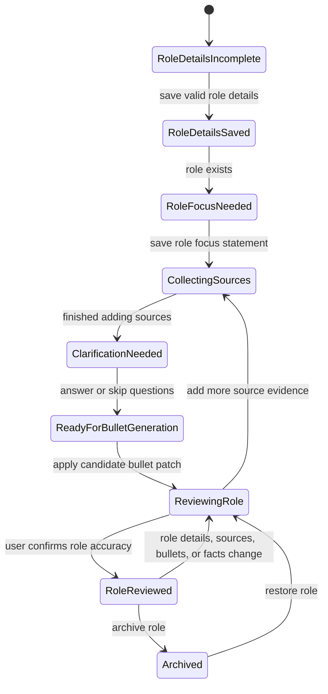
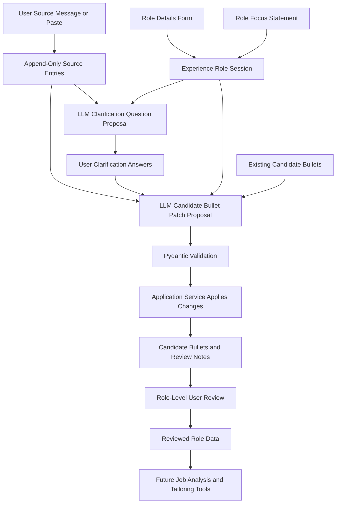
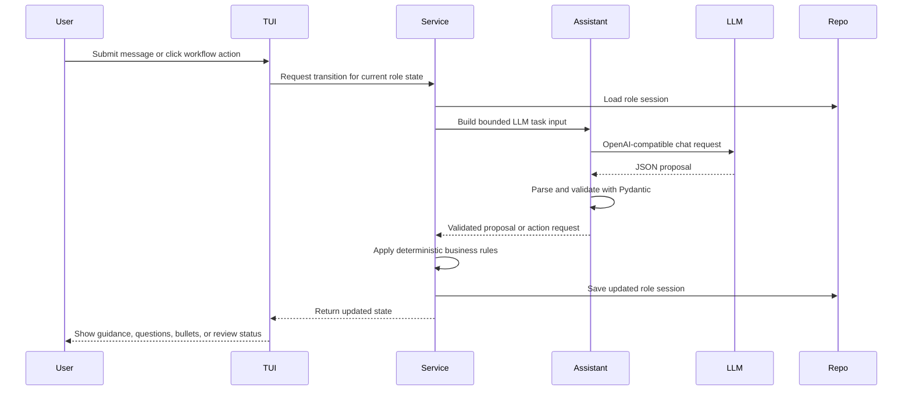

# Experience Role Workflow

This document describes the intended role-level experience workflow for Career Agent.
Some pieces are already implemented, while others are planned. The goal is to make the
logic flow easy to review before continuing implementation.

## Purpose

The role workflow turns user-provided experience evidence into reviewed, structured role data.
The application owns workflow state and persistence. The LLM provides bounded proposals,
questions, guidance, and revisions that are validated before the application applies them.

Core design rules:

- Role details are captured through deterministic form fields.
- Source entries are append-only evidence.
- Candidate bullets are editable role components, not the primary finalization gate.
- The role, not every individual bullet, is reviewed by the user.
- Reviewed roles remain editable; material changes move the role back to needs review.
- LLM output is treated as a proposal, not a direct data mutation.

## State Machine

## Data Flow

## LLM Proposal And Tool Action Pattern

## Planned Workflow

1. The user opens a new role workflow.
2. The user completes the role details form.
3. The application saves role details and creates the durable role session.
4. The assistant asks for a short role focus statement in the user's own words.
5. The user adds append-only source entries.
6. The user indicates they are finished adding sources.
7. The assistant proposes clarification questions when source material is ambiguous.
8. The user answers or skips clarification questions.
9. The assistant proposes candidate bullet creates, updates, unchanged items, and warnings.
10. The application validates and applies the proposal through service methods.
11. The user reviews the role through bullets, notes, and revisions.
12. The user marks the role reviewed when it accurately represents their experience.

## Data Ownership

Source entries are retained evidence. They are not edited after submission. If the user needs
to correct or add context, they add another source entry.

Candidate bullets are generated or revised artifacts. They can be edited, removed, or revised
through guided interaction, but they should retain source references and revision history.

Reviewed role data is the trusted input for downstream job analysis and tailoring. The reviewed
state is not a lock. Later changes should return the role to a needs-review state.

## LLM Safety Rules

- The LLM should not edit files or persisted data directly.
- The LLM should return structured proposals, patches, evaluations, or action requests.
- Pydantic schemas should validate LLM output before application services apply changes.
- Application services should own all persistence and workflow transitions.
- Evaluation should check grounding, duplication, unsupported claims, and inflated language.
- Prompt versions, source references, user corrections, and model metadata should be retained
  where practical for future debugging and eval-driven iteration.
